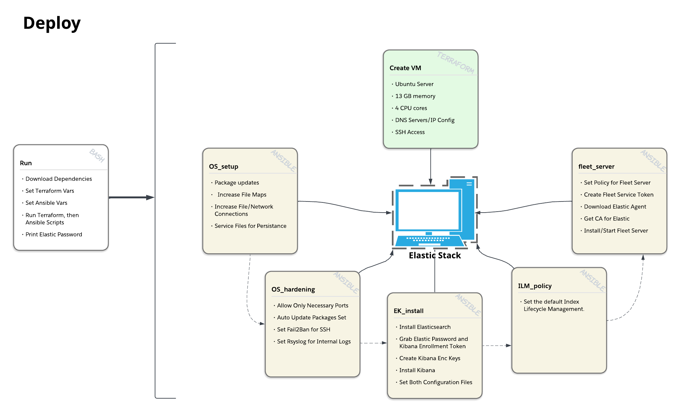

# HomeLab ReadMe
## Summary
This repository hosts all the automation developed for my homelab, also designed to be fairly transmutable for others. The purpose of these scripts is to allow easy and seamless deployment and setup of resources to allow more advanced homelab uses. With a limit of homelab resources, quickly deploying, setting up, and tearing down resources is extremely valuable. While this is an investment into the future of the homelab's application, its also a fantastic method to continuously improve development skills. 

*Note on AI Usage:*
- As the goal is learning and staying fully engaged, AI will be used sparsely, and will be a third option *(docs and then 3rd party sources first)* when anything that is valuable to learn is involved. While I do think no AI usage is great for "perfect" self-development, AI is a useful tool for efficiency when used in the correct dosages, and is not leaving the IT/Tech space for the foreseeable future. 
- AI usage will be cited as its used, within the docs and code. 
- The main AI's used will be (1) Claude (free version).
- As of writing this, no token limits have ever been hit. 

## SIEM
The purpose of adding a SIEM is to establish logging and alerting for the malware analysis labs conducted within the homelab. The idea is to allow better analysis of malware, playing both red and blue, tuning both simultaneously. 

The SIEM chosen is an Elastic Stack, currently using Elastic, Kibana (frontend), and Elastic Agent for shipping to and from endpoints. There are many reasons that Elastic was chosen over other options such as Wazuh. Elastic can be used at an enterprise level, and can be extremely adaptable. Especially as it will continuously be automated, it should produce more applications, whether it be logging services deployed on the homelab, or tuning logs and alerts to adapt and understand the effects of a piece of malware. These reasons also make for many facets to improve with, creating an efficient method to develop learning.  

### Deploy

The first step in using the SIEM is properly deploying it. As the Elastic stack has quite a few configuration steps for the operating system, network, Elastic, and Kibana. To deploy the SIEM in a manner that can be deterministically repeated (idempotency), I used Terraform, Ansible, and Bash.

- **Terraform**: Create and manipulate Proxmox resources.
- **Ansible**: Change the state of devices.
- **Bash**: Manipulate variables, Ansible, and Terraform. 

*Note: Hard-coded Values*
*Currently there are two core values that are statically set within the scripts; `elastic/kibana version` and `memory allocated`. The `version` is set to the latest stable, and can be manually changed if a different version is wanted. For `memory`, the SIEM is allocated 13 GB to use for a node. This is designed to be used on devices that have at least 16 GB of memory. In the future, a multi-node setup for Elastic can be developed.*

#### Usage:

##### `/homelab-automation/SIEM/scripts/run.sh`

1. `cd SIEM/scripts`
	Change directory to scripts. 
2. `chmod +x run.sh`
	Make the script executable.
3. `./run.sh`
	Runs the script. Can either follow the prompts asked in the script to set key variables, or manually change them by editing them at the top of the script. Other than names, key variables are put through regex to ensure they are in the correct format.
	The script will start by asking to download Terraform and Ansible if needed, then check/prompt for all variables, and finally run the Terraform and Ansible commands to deploy the Elastic SIEM.

#### Docs:

##### `/homelab-automation/SIEM/docs`

- `ansible_docs.md`: Ansible methods used.
- `deploy_docs.md`: Dev process, decisions, citations, what each script does and why.
- `proxmox_terraform_setup.md`: Setup a template and service account in proxmox to use.

Includes all the documentation for the Deploy scripts. It includes the development process used and decisions. Also walks through what the scripts are doing and why, and provides bonus documentation on all the different methods used in the Ansible scripts. Reading the docs would give you a good idea of where to make changes if necessary.
